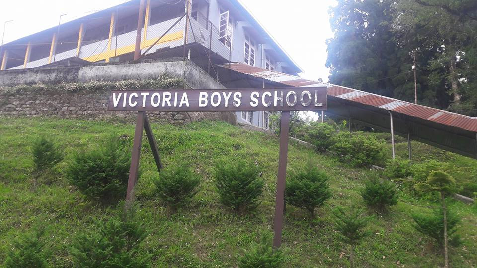

<head>
<title>
Those days of my lilfe...
</title>
<link rel="stylesheet" type="text/css" href="style.css">
</head>

<body>

~ <a href="https://www.facebook.com/profile.php?id=100004470360895">
Ashish Kumar </a> 

  
<h1 font-color="rgb(128,0,0)"> Those days of my life... </h1>
  

<p1>
Life on the hills aren't very similar to that in the plains (I will be using the word plains to refer to the places which are not hills). People living in the hills live a completely different life. For those people who keep visiting the plains may not know very well but I can say that because I have lived my childhood on the hills; staying away from my home and parents. I was only 10 when I started living in the hostel on one of the hills in the Darjeeling district (West Bengal, INDIA). The Darjeeling district is worldwide famous for their tea garden and the tea quality. They have sold the costliest tea ever, 16,000 rupees for a kilogram once. But it is not only famous for the tea in India, it is also famous for the education hub it has on its hills, it has more than 100 schools in the district with local smalls schools to highly reputed schools like North Point, St. Paul's and Victoria school. Student in these schools are not only from different parts of India but also from the neighboring countries like Bangladesh, Nepal, Bhutan, Thailand, Hong-Kong, Myanmar, Indonesia, Korea etc. I studied in Victoria school (Or rather Victoria Boys' school), one of the oldest school of India. It was established in 1879 during the reign of Queen Victoria. It was built by the British that time because they were not comfortable living in plains during summer so they lived on the hills. They needed a school for their children on the hills, so they built the school. It is 139 years old now (2018) and is considered to be one of the most haunted places in India (that's a story for another blog). 
</p1>
  

<p2>
As I mentioned I was 10 years when I started living in the hotel in the hills. 10 years is a very young age to stay away from home but my parents had no choice, I belong to a very small town in the states of Bihar. There were no good school in my home town so they had to send me away, now they had to decide where, but my grand-parent had just visited the Darjeeling hills and they liked the schools and the environment there. They thought it was good enough for me to stay there as a border and it was them who suggested my parents. That decision changed my life forever, I had begun preparing myself to stay away from home because I always knew they were planning of sending me away. So I joined the Victoria school. It is the most unique school in India, it is a government school which is ICSE based (the only ICSE  government school in India) and it has direct contacts with the state government. The school gets fund from the state government so the education for the students were free, we only paid for food and lodging. It was unlike any other government school, all the teachers were good and responsible, they lived with us away from their homes in their quarters, so we depended on them and they depended on us. We all lived like a family, the environment in the school were always emotion based. People were influenced and motivated by the emotion. The students also had bonds of brotherhood. The staffs working were also happy with their job and served well. 
</p2>
    

<p11>
The bare tree
</p11>
   

<p3>
My journey towards the gifted life began on the 7th of march 2007 (I still remember because I could never forget). My parents told me to stay careful, don't go into the forest, don't be very adventurous, stay in the campus, listen to the teachers, don't fool around (I would also want to mention that our campus was not bounded, it was open in all direction, people could easily bunk from school, go into the forest or anywhere they wanted). So first I feared the hills but then it became my home. I played in the khuds, went into the forest and had great time. The first year there was very adventurous and exciting, I loved the beauty of the nature, the fresh air, the smell of the pine forest and the storms during the monsoon. There used to be time when it would rain continuously for a week non-stop. And when the rain stopped and sun was out we would get sun-shine holiday for the day to soak and take the sun-bath. The place was beyond imagination, beautiful and I considered myself in heaven. We had different competitions, inter-school and inter-house competitions. I was in kellas house (the blue house, the other two house are Mallory, the yellow and Irvine, the red house), the house competitions were the best part of the whole year. We had inter-house competitions for every sports, track and field and also cultural event (the house concerts) and academics. The best out of them was cultural event competition where  people would prepare for the event 1 month before the competition and perform on the event day. Each house performed for one evening and at the end of the third day the results would be announced. The fun was that while the house would be performing the other two house would sit as audience and they would tease, call, shout and whistle making the show a hit (but sometimes that would disturb the performance and then there would be a huge fight between the house where the whole school is divided into three groups and two of the group would fight). The best performance from all the three ] houses were chosen for the annual school concerts where the other schools would come as the audience. I was the part of the chorus song of the house and the Hindi and Bengali group song for my house and was chosen for the chorus song for the annual concert. The annual sports day was also as exciting and the final decision of the result of the cock house was decided on that day. My friends would often feel home-sick but I was never sad for staying away from home, I had discovered the heaven while I was alive so I enjoyed every moment of it. So this way my first year in the hills was over. When I came back home in winter holidays (we had 3 months' holiday in winter because it would be very cold there of sometimes snow or hail storm) I felt my home very small because the school had a wide space and large rooms and I had been habituated of that. 
</p3>
    
<p12>
Leaves appearing
</p12>
   

<p4>
After only 2 months at home I started missing school, I wanted to go back as soon as possible I started packing things I would need for the next year, also the things that I needed last year but did not take because it was not mentioned in the kit list and I had no idea about them. I also carried things which was not allowed in the school, the FM radio (by now I had seen many seniors listening to songs on radio without being caught so I thought I would do the same). Next years was as fun as the previous. I also started learning the local language there (Bengali and Nepali). Now I had friends that would always be around, teachers knew me and I had started taking parts in various events in the school. The year had begun well this time, there was a hail storm this time after we joined the school and the ground was covered white with the ice. The ice did not melt for the whole night and we played with it the next morning. I took taekwondo classes for a week and I still consider myself a martial artist. All the other things happened as the first year but there many more interesting things that happened that year. The Beijing Olympics was held that year and we were shown few of the events from the Olympics, the wrestling (Sushil kumar), shooting (Abhinav Bindra) and the boxing (Vijendra Singh). We were very excited supporting them while watching and were so excited that my classmates decided to organize a boxing tournament without anyone else knowing. We had the matches held in the dormantory. I lost my first match against the friend, who won the final. He had beaten me so much during the match that my eye was swollen and dark. I had to stay back in dormantory for the next day to prevent people from knowing about the tournament. We had a lot of fun that year but I missed the house concert (house concerts were no more held because the previous year seniors had a big fight for the house and also the instruments that school provided were not shared properly created a lot mess in both students and teachers). We still had annual concert and everyone prepared for that together. By now all my friends had started to live like a Victorian and never felt home sick ever.
</p4>
   
<p13>
Spring Blossom
</p13>
   

<p5>
The winters holidays seemed even longer this time, I had very few friends left near my home. Mostly because I was too young to maintain friendship also because I was more of TV watcher than a gully player. The coming year my brother was also supposed to join my school as he had come to the same age as I was. We were packing to go back to school, he asked me a lot of questions related to school and I was happy explaining. I said you will have so much fun that you would not want to come back home. There is a problem with every human in this world, they are never satisfied with whatever they have, they always want more, they always think of what they don't have instead of what they have. Same was our situation, we knew our school was too good a place to be at but we always looked down at the plains and thought of a city life and enjoyments. Our school was in the middle of a forest, although our campus was open if we bunked it took 20 minutes to reach the town and 1.5 hours to reach the city. Bunking was one of the general sport in the students as the chances of being caught were very less, we not only bunked to town or the forest we also bunked to the girls' schools nearby. Teacher did not take big actions if we were caught bunking to town or the forest (least action or no action) but if caught in girls' schools we were most likely to be suspended. So the year began as usual, I had to keep my fun in some limit because now my brother was also here so he would know all about my mischiefs and would tell at home. This year was similar to the last two years; we had fun, enjoyed the weather, beauty etc. we had a new thing this time in our school called the VPL (Victorian premium league) after the success of the IPL the previous year. Good cricketers were chosen form juniors to seniors and made into some 6 teams. It was as exciting as the IPL, whole school came to support their favorite team, the organizing class had also prepared the trophy by pulling out the glass pane of a window of the class and then decorating that as a trophy. They also cut a piece of wood into small bat and wickets for the highest scorer and wicket taker. Rest of the year went as usual. We come to the end of the year and at the end of each we gave farewell to the seniors by celebrating the bonfire on the last evening of the year. I was to junior to GAF about the farewell and seniors, to me it was another day of celebration and fun. 
</p5>
   
<p14>
Yellow as the Gold
</p14>
   

<p6>
After the session gets over we remain away from home for such a long time that we want to go back home, we get bored of the school and want changes but within 1 and half month at home we realize that home is no fun and we start calling our friends and talk about their holidays and next year plans. When we come back from home we discuss all the fun we had at home, all the trips and movies we saw, people brag, tell stories etc. Staying with friends for 3/4th of a years had made them a family, every class in Victoria was a family who stood together had similar thoughts or came to any conclusion together. My class was famous for our unity in the class, although we were junior, the seniors had felt our unity, we took great pride in that. They said it's very hard to get the secrets of your class out from anyone, you all speak same words when asked (actually till we were in class 5th  we were not in sight of seniors much because our dormentories were away from the senior block but as we came to 6th we came in their sight and raging and bullying by senior was tradition in my school so the seniors wanted to know dirty secrets of the class and the students so they can blackmail, torture, rag and bully so they would try to make friend with some of the student ask them about everyone and then they would get what they want but we knew about the raging and their strategies so we had already prepared for it). Even the most senior batches did not have the kind of unity we had, as much as they praised our unity they were also angry about the situation so they used different ways to get us, some got into the trap but I always remained away from those seniors. My distraction towards the seniors had also pissed some seniors but they couldn't do anything about it. They got chances to rag me some time but their ego was never satisfied. We had stepped into the situation in Victoria where people used their political mind to save their ass. Rest of the things went as usual except for the unusual interruption from the seniors. 
</p6>
   
<p15>
Brown as the Old
</p15>
   

<p7>
Now we were in 8th standard, life was getting serious, we started focusing on our studies. Every teacher said us to focus, else we would land nowhere. One of the teacher called us the most Bogus class in Victoria (there is always a teacher who says that). Now we were junior to only 10ers (because in Victoria if you are one class senior you are not senior) so we were senior now. Along with the seniority we also had an image to maintain because teachers kept eye on 8ers to choose the prefect next year and everyone in class 8 changes to their best behavior for the year (except the exceptional). We also had a responsibility during the concert as 8ers to look after the back stage and green room or any other management things along with the teachers (which is the job of every year 8ers). I was the usher (officially allotted job) but also helped my friends backstage to manage the curtain and stage decoration for different events. That went well but the greatest experience I had that year was an earthquake of 6.8 on the Richter scale. I was in the assembly hall as everyone was, it was evening studies time, I was shaking my leg sitting on the desk then I stopped my leg but I felt it was still shaking I looked down at my feet I didn't know what was happening then I looked up in front, I saw the wall in front of me swaying from one side to other. By the time I realized what was happening people had started to rush towards the door to go to the ground; I saw I was too far from the door to make it outside on time so I went under my desk for a moment, then I looked up saw the crowd had reduced then I decided to take the desk with me till the door and leave it near the door when I feel I can pass, so I did that. After few second current went off, people started to panic, I was looking for my brother and he came looking for me. We felt relief but my friend's day was ruined, it was his birthday which would also become his last day, if something bad had happened (but our school infrastructure is too strong to hold those kind of earthquakes or severe storms, built during British time, walls more than a foot thick). Rest of the year was as usual but that earthquake had given us a memory of lifetime.
</p7>
   
<p16 >
Leaves on the ground
</p16>
   

<p8>
Years were passing and we had been so habituated with beauty and benefits of the place that we ignored them and now we wanted to live the life as in plains, surrounded by people. We called our school a jail because we were disconnected to the rest of the world, only students and teacher were the people we met every day. We were getting bored of it, now we were seniors we needed more fun we started bunking more frequently, we would go to the town have good food, rest somewhere in the forest and came back when we felt, we had been out for long. Now we were in our puberty so there rose a season of love in our class, people falling in love with the girls had been friends with, they started bunking to their schools to meet, pass love letters etc. My friends said me also to get a girl but after saying no for a long time I decided to write a love letter to a girl. I sat in the class on Sunday with a friend who wrote the letter nicely then asked one of my friend who had his girlfriend in her school to carry the love letter for me, it was not only me who had written that week, few of my friends also wrote, so the carrier friend asked each of us if we really loved and we were sending or just for fun all of us said no it was true love but at the last moment I asked my letter back. That day I saved myself from falling into trap a big trap. Then came the time of concert, like in class 8 we had a job similarly 9er had another job that was taking care of the stall. This is a hell of a job because it comes to the reputation of the class, we started preparing for the decoration with the preparation of the events. We really put great effort then we had a big budget for the stall so that we could provide with a lot of options and the stock should runout. It was a hit, we were praised for our arrangement decoration (except that we made loss because we had a huge stock and all did not sale, so we paid for the loss but used everything and partied hard for next few days).
</p8>
   
<p17>
Bare again
</p17>
   

<p9>
Years passed and we reached to the last years as a Victorian. We got bored of the school so much that we wanted to pass out as soon as possible but we also knew that we would meet our friends, we didn't think that we would ever miss the school (jail) all we cared was the friends (but the story is different now we miss the school and the days passed there it does not matter who we were with that place is what we miss, the perfect beauty, the nature, the calmness everything was so perfect, we had a peaceful life there). As the day was progressing we kept the seeing the calendar tree (the only maple tree in whole Darjeeling district and it is called the calendar tree because when we join the school it remains empty as we are then as we start getting involved in the school activities it starts getting leaves then comes the monsoon when it gets wet along with us, then comes the winter when comes our final exams and time for us to go back home and it sheds off its leaves). The calendar tree is one thing that keeps reminding about the time we are left in the school. We never felt such connection with the tree before but now it was different, everything was different, we were serious about the studies, we having last of everything, last tournament, last concert, last classes etc. It was very emotional year. During the monsoon we would bunk to the forest to eat the berries (yellow raspberries) that grew only during that time and had so much of the berries on each tree that we could fill out stomach fully but the tree would still have enough of berries for the next day. Everyone had a particular berry spot where they would go every year and when their stock gest over means everyone's stock is over then we would go deep into the forest to look for the left berries. The berries tasted like half ripen guava with a lot of water and small seeds made it crunchy. The taste is unforgettable, it grew on the tree with a lot of spines and we would get a lot of spines in our hand while plucking but it was always worth it. The rest of the year would go as usual with sentiments and emotions. Then came the last day of bonfire when we made a dummy of the headmaster to be burnt and had fun making that but when the time came to enjoy many people including me sat on the parapet staring at the juniors enjoying remembering the past 7 years and everything we did here together. Finally leaving the school was a lot harder than it had seemed to me when I saw my seniors crying when they left. 
</p9>
   
 
<iframe height="260"
    allowTransparency="true"
    frameborder="0"
    scrolling="no"
    overflow:hidden
    style="width:100%;border:none"
    src="https://ashjai181.wufoo.com/embed/zgq00370t70b9r/">
</iframe>                                             
</body>